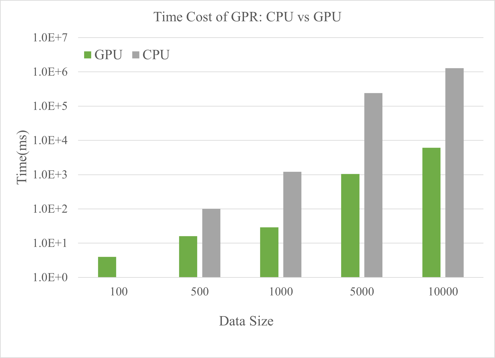

## Gaussian Process Regression with GPU Acceleration

This project aims to accelerate Gaussian Process Regression (GPR) computations using NVIDIA GPUs. It includes both CPU-based and GPU-accelerated implementations of Gaussian Processes (GP), with the GPU version leveraging NVIDIA's cuSolver library to significantly enhance performance.

Both the CPU and GPU versions of GPR in this project are experimental, developed as part of an exploration to deepen the author’s understanding of CUDA. These implementations are not recommended for production environments without thorough testing and consideration.

### Performance Comparison

The following table compares the time costs for GPR computations on an Intel i7-10700 CPU paired with an RTX 2080 Ti GPU, and 32GB of RAM.

| Data Size | GPU (ms) | CPU (ms) |
|:---------:|:--------:|:--------:|
|    100    |    4     |    1     |
|    500    |    16    |   101    |
|   1000    |    29    |   1212   |
|   5000    |   1043   |  239928  |
|   10000   |   6073   | 1277158  |

### Graphical Representation

The graph below visually compares the time costs of GPR on GPU versus CPU. The vertical axis uses a logarithmic scale for better visualization of performance differences. 

When the data size is 100, the CPU takes 1 ms, which is barely visible in the graph.




### Build and Run Instructions

This project supports building and running on both **Windows** and **Linux** platforms.

#### On Windows Using CLion
1. Install CLion IDE (ensure it supports CMake).
2. Install the NVIDIA GPU driver and CUDA Toolkit (ensure `nvcc` is available in the PATH).
3. Open the project in CLion. The IDE will automatically detect the `CMakeLists.txt` file and configure the build system.
4. Ensure that the `CUDA_TOOLKIT_ROOT_DIR` is correctly set in the `CMakeLists.txt` file or within CLion's CMake configuration.
5. Build and run the project directly from CLion.

#### On Linux Using CMake and Make
1. Ensure the following dependencies are installed:
   - `g++` or `clang` compiler
   - `cmake >= 3.30`
   - CUDA Toolkit (ensure `nvcc` is available in the PATH)
   - NVIDIA GPU driver
2. Compile the project using the following commands:
   ```bash
   cd /path/to/project
   mkdir build && cd build
   cmake ..
   make
   ```
   Ensure that the `CUDA_TOOLKIT_ROOT_DIR` is correctly set in the `CMakeLists.txt` file if the `cmake` command does not automatically detect it.

3. Run the compiled executable:
   ```bash
   ./GP_CUDA
   ```

### Notes
- Ensure your device supports CUDA and is properly configured for GPU acceleration.
- To modify the input data size or other parameters, adjust the relevant sections of the source code and recompile the project.

